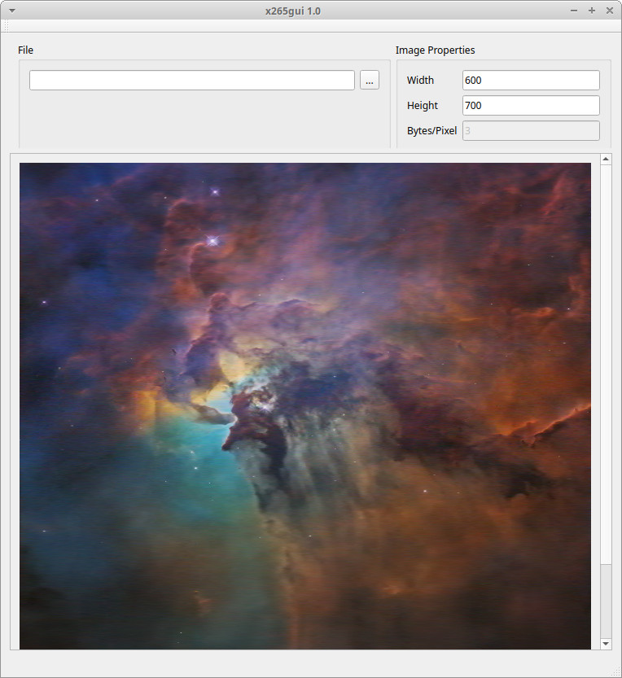

# x265gui

An application to visualize raw hevc stream received over UDP.

To run:

```
./x265gui

```



Run the x265gui first, then run the [x265](https://github.com/jambamamba/x265) streamer second


This repository is based off [https://bitbucket.org/multicoreware/x265/src/default/](https://bitbucket.org/multicoreware/x265/src/default/)


